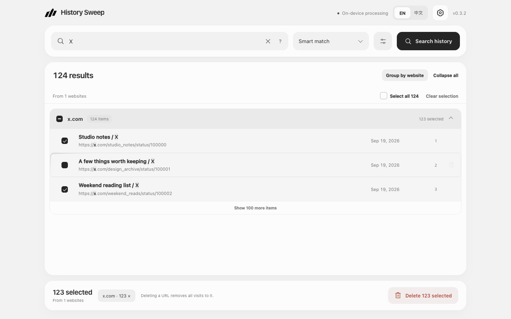

# History Sweep

**English** · [简体中文](README.zh-CN.md)

Find the browsing history you want to remove. Keep everything else.

History Sweep is a Chrome extension that helps you search, review, and delete browsing history by website, keyword, or date. Clear a single page or a batch of results without wiping your entire history. Everything is processed on your device, with no account or history upload.

[Install from Chrome Web Store](https://chromewebstore.google.com/detail/bbccfejdhhcjmpfagjckiikgllpojhgm) · [Website](https://sweep.agentclub.dev/)

## What you can do

- **Find the right pages.** Search by website, exact domain, domain and subdomains, or words in page titles and URLs. Suggestions from your own history help you complete a search, with support for Simplified and Traditional Chinese text.
- **Narrow down by date.** Choose today, the last 7 or 30 days, or a custom date range. You can also search by date without a keyword.
- **Review by website.** Results are grouped by hostname. Expand a website, select its matching pages together, or switch to a flat list and choose individual pages.
- **Keep websites you care about.** Add domains to your kept websites. Their pages and subdomains stay out of deletion.
- **Delete one page or a batch.** Review the selected URLs before confirming. Deleting a single row leaves your other batch selections in place.
- **Choose your space.** Use a compact toolbar popup, a full-page workspace, or a modal over the current webpage. Change the opening method in Preferences.
- **Search the current website.** Use the popup's current-website button or the page's right-click menu to find that site's history.
- **Use English or Simplified Chinese.** Switch languages in the extension; your choice is remembered.

## When History Sweep fits

Choose History Sweep for a deliberate cleanup: find a website, review the matching URLs, keep exceptions, and confirm what to remove.

- **A website and a mention of it are different.** Smart match for `example.org` matches that domain and its subdomains. A URL such as `https://example.com/?query=example.org` does not belong to that website. Choose **Title or URL** when you want to find the text instead.
- **Keep control of the selection.** Review results by website, select a group or individual pages, and leave the pages you want to keep. Kept-website rules provide another way to exclude domains and their subdomains.
- **Review before, check afterward.** The confirmation lists selected URLs by website. After deletion, History Sweep checks the selected URLs for remaining visits and reports the result.

Different workflows call for different tools. In our hands-on comparison, **Better History 7.0.0** offered a broader history-browsing workspace with date/hour navigation and export controls. **History Cleaner Pro by HVS 1.1** offered a compact keyword-search and selected-deletion popup. **History Cleaner by Tags 3.2.0** exposed tag/rule and automatic-cleanup settings; scheduled execution was not evaluated. History Sweep focuses on search, selection, and a reviewed cleanup.

See the [test setup, observations, and limits](docs/comparison-2026-10.md). The comparison uses the **0.3.2 repository build**, with competitor observations from October 1, 2026. It is a small, single-environment task comparison, not a speed benchmark or a claim of overall superiority. The Chrome Web Store may serve a different version; check your installed version before comparing features.

## Get started

Install from the [Chrome Web Store](https://chromewebstore.google.com/detail/bbccfejdhhcjmpfagjckiikgllpojhgm), pin History Sweep to your toolbar, and click its icon. Requires Chrome 110 or later.

1. Enter a website or keyword, or choose a date filter, then search.
2. Review the results and select the pages you want to remove. Website selection and Select all include matching pages beyond those currently visible.
3. Click **Delete selected**, review the confirmation, and confirm. You can cancel without removing anything.

Confirmed deletion continues if you close the extension view. Keep Chrome running, then reopen History Sweep and search again to review the result. Opening the full page carries over your search conditions; select the pages again in that view.

You can also download a package from the [website](https://sweep.agentclub.dev/#get). Unzip it, open `chrome://extensions`, enable **Developer mode**, choose **Load unpacked**, and select the extracted folder. If using this repository directly, select `extension/`.

## Your history stays on your device

History Sweep does not upload browsing history, require an account, or add analytics. Searches, suggestions, and deletion are processed locally. Your language, kept websites, and opening preference are saved on this device.

Chrome's history permission lets the extension search, remove, and verify records. Other permissions support the current-website action, right-click entry, in-page modal, and saved preferences. The extension does not collect page content or run remote code.

Read the [privacy policy](https://sweep.agentclub.dev/privacy) for details.

## Before you delete

**Deletion cannot be undone. Removing a URL deletes all visits to it, including visits outside your chosen date range.** Date filters use each URL's last visit. Chrome may sync history deletions across signed-in devices.

Each search reads up to 100,000 URLs. If that limit is reached, a notice appears and older records may be missing. Suggestions and current-website searches never select or delete pages automatically.

Keep Chrome open until deletion finishes. Tasks do not resume after Chrome exits, the extension reloads, or its background process stops unexpectedly. If a webpage cannot display the in-page modal, History Sweep opens the full workspace instead.

## Feedback

Found a problem or have a suggestion? [Open an issue](https://github.com/agent-club/history-sweep/issues).
