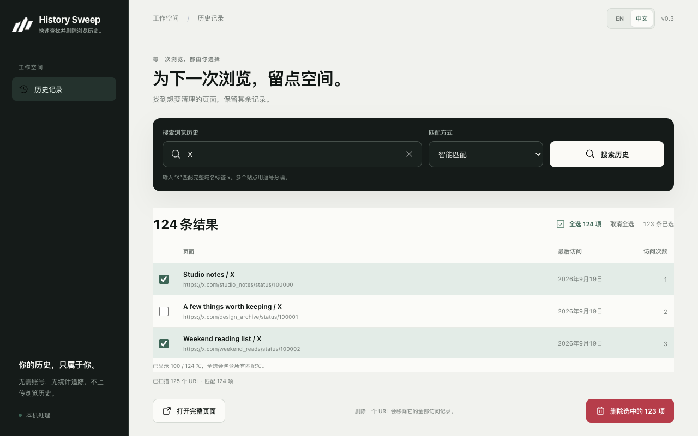

# History Sweep

[English](README.md) · **简体中文**

找到想删除的浏览记录，留下其余内容。

History Sweep 是一款 Chrome 插件，帮助你按网站、关键词或日期搜索、查看和删除浏览历史。你可以删除单个页面，也可以批量清理选中的记录，无需清空全部历史。所有处理都在本机完成，不需要账号，也不上传浏览记录。

[从 Chrome 应用商店安装](https://chromewebstore.google.com/detail/bbccfejdhhcjmpfagjckiikgllpojhgm) · [访问官网](https://sweep.agentclub.dev/)

## 可以做什么

- **找到要清理的页面。** 按网站、精确域名、域名及子域名，或页面标题和网址中的关键词搜索。本地历史记录提供输入建议，支持简繁中文匹配。
- **按日期缩小范围。** 选择今天、最近 7 天、最近 30 天或自定义日期范围，也可以只按日期搜索。
- **按网站查看记录。** 结果按主机名分组。展开某个网站，整组选中匹配页面，或切换为平铺列表，逐条选择。
- **保留重要网站。** 将域名加入保留网站列表，该域名及其子域名下的记录不会被删除。
- **单条或批量删除。** 确认前查看待删除的网址。删除单条记录时，其余批量选择会保留。
- **选择合适的操作空间。** 使用工具栏小窗、完整页面，或覆盖在当前网页上的浮窗。在偏好设置中选择打开方式。
- **查找当前网站的历史。** 点击小窗中的当前网站按钮，或使用网页右键菜单，查找该网站的浏览记录。
- **使用英文或简体中文。** 可以在插件内切换语言，插件会记住你的选择。

## 开始使用

从 [Chrome 应用商店](https://chromewebstore.google.com/detail/bbccfejdhhcjmpfagjckiikgllpojhgm)安装，将 History Sweep 固定到工具栏，然后点击图标。需要 Chrome 110 或更新版本。

1. 输入网站或关键词，或选择日期筛选，然后搜索。
2. 查看结果，选中要删除的页面。按网站选择和全选都会包含当前尚未显示的匹配页面。
3. 点击**删除所选**，检查确认内容后再确认。取消不会删除任何记录。

确认删除后，即使关闭插件界面，任务仍会继续。请保持 Chrome 运行，之后重新打开 History Sweep 并搜索，查看清理结果。打开完整页面时会带入搜索条件，但需要重新选择待删除的页面。

你也可以从[官网](https://sweep.agentclub.dev/#get)下载安装包。解压后打开 `chrome://extensions`，启用**开发者模式**，点击**加载已解压的扩展程序**，选择解压后的文件夹。如果直接使用本仓库，选择 `extension/` 目录。

## 浏览记录留在本机

History Sweep 不上传浏览历史，不需要账号，也不添加分析追踪。搜索、输入建议和删除都在本机处理。语言、保留网站和打开方式偏好仅保存在当前设备。

Chrome 的历史记录权限用于搜索、删除及核验记录。其余权限用于当前网站入口、右键菜单、页面内浮窗和保存偏好。插件不收集网页内容，也不运行远程代码。

详情请查看[隐私政策](https://sweep.agentclub.dev/privacy)。

## 删除前须知

**删除后无法恢复。删除一个网址会移除它的全部访问记录，包括所选日期范围之外的访问。** 日期筛选依据每个网址的最后访问时间。Chrome 可能会将删除同步到已登录的其他设备。

每次搜索最多读取 100,000 个网址。达到上限时会显示提示，更早的记录可能未包含。输入建议和当前网站搜索不会自动选中或删除记录。

请保持 Chrome 运行直到删除完成。浏览器退出、插件重新加载或后台进程意外停止后，任务不会恢复。如果当前网页无法显示页面内浮窗，History Sweep 会打开完整页面。

## 反馈

发现问题或有建议？欢迎[提交 Issue](https://github.com/agent-club/history-sweep/issues)。
